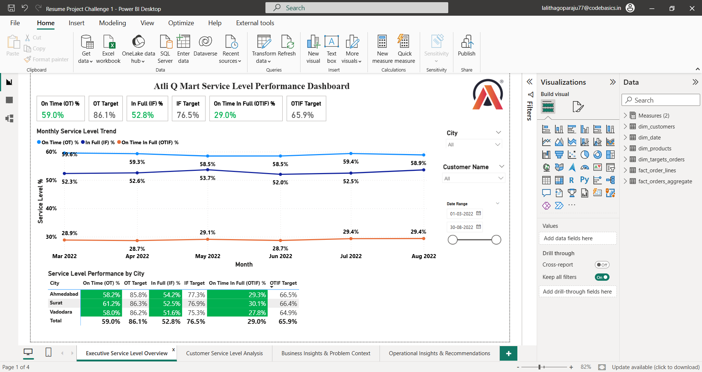

# 📊 AtliQ Mart Supply Chain Analysis

## 🧾 Project Overview
This project focuses on analyzing supply chain performance for AtliQ Mart, a growing FMCG company, to identify service level issues and improve customer satisfaction.

The objective is to track and analyze key delivery metrics such as On-Time (OT), In-Full (IF), and OTIF (On-Time In-Full) to support data-driven decision-making before expanding to new cities.

---

## ❗ Problem Statement
AtliQ Mart operates in Surat, Ahmedabad, and Vadodara and plans to expand to metro/Tier-1 cities.

However, some key customers have not renewed their contracts due to poor service levels:
- Delayed deliveries  
- Incomplete deliveries  

Management wants to:
- Monitor service performance daily  
- Identify problem areas quickly  
- Improve delivery reliability before expansion  

---

## 🎯 Objective
- Analyze delivery performance using key service metrics  
- Compare actual performance with target benchmarks  
- Identify performance gaps  
- Provide actionable business insights  

---

## 📌 Key Metrics
The dashboard focuses on the following KPIs:

- **On-Time Delivery (OT%)**  
- **In-Full Delivery (IF%)**  
- **On-Time In-Full (OTIF%)**  
- **Line Fill Rate (LIFR)**  
- **Volume Fill Rate (VOFR)**  

📌 OTIF is a critical metric as it measures both timeliness and completeness of deliveries, reflecting overall service reliability.

---

## 📊 Dashboard Features
- KPI overview with target comparison  
- City-wise performance analysis  
- Customer-wise service level breakdown  
- Monthly trend analysis (with drill-down capability)  
- Product-level insights (LIFR & VOFR)  
- Conditional formatting to highlight performance gaps  

---

## 📁 Dataset Information
The project uses multiple datasets:

- `dim_customers` – Customer details  
- `dim_products` – Product information  
- `dim_date` – Date hierarchy  
- `dim_targets_orders` – Target metrics  
- `fact_order_lines` – Order-level data  
- `fact_orders_aggregate` – Aggregated delivery performance  

---

## ⚠️ Data Disclaimer
Datasets used in this project are not included in this repository due to data privacy and usage guidelines.

However, the dashboard, insights, and analysis are fully based on the provided dataset structure and business problem.

---

## 🛠 Tools Used
- Power BI (Dashboard Development)  
- Excel (Data Preparation)  
- SQL (Data Analysis concepts)  

---

## 📸 Dashboard Preview

### Executive Service Level Overview

### Customer Service Level Analysis

### Business Insights & Problem Context

### Operational Insights & Recommendations

---

## 🎥 Project Presentation (Audio Explanation)
👉 [Click here to listen to the project explanation](https://drive.google.com/file/d/1_h8qlJdZeo3RP5AQfzmIfBrwMv_9je40/view?usp=sharing)

---

## 💡 Key Insights
- OTIF performance is below target, impacting customer retention  
- Some cities consistently underperform in delivery metrics  
- Certain customers experience repeated service issues  
- Product-level fulfillment gaps impact overall service quality  

---

## 🚀 Recommendations
- Improve coordination between supply chain and logistics teams  
- Focus on high-impact customers with low OTIF performance  
- Optimize inventory planning for frequently delayed products  
- Implement real-time monitoring dashboards for quick decision-making  

---

## 🙋‍♀️ Author
**G R S S Sri Lalitha**  
Aspiring Business Analyst | Power BI | SQL | Excel | Data Analysis | Data Visualization
