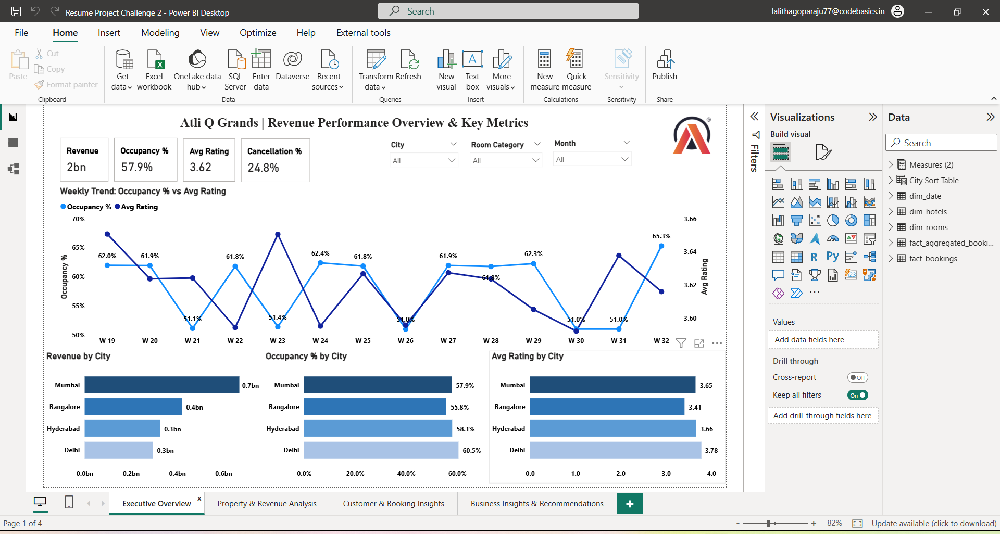

# 📊 AtliQ Grands Revenue Performance Analysis

## 🧾 Project Overview

This project focuses on analyzing revenue performance for AtliQ Grands, a luxury hotel chain in India, to identify key factors impacting revenue decline and market share loss.

The objective is to leverage data analytics and business intelligence to uncover insights related to occupancy, pricing, customer behavior, and booking patterns, enabling data-driven decision-making for revenue growth.

---

## ❗ Problem Statement

AtliQ Grands has been operating in the hospitality industry for over 20 years but is currently facing:

- Declining market share in the luxury/business hotel segment  
- Revenue loss due to increased competition  
- Ineffective decision-making due to lack of data insights  

The company lacks an in-house analytics team and wants to:

- Monitor revenue performance across cities and properties  
- Identify problem areas quickly  
- Improve strategic decision-making using data  

---

## 🎯 Objective

- Analyze revenue performance using key hospitality metrics  
- Compare performance across cities and properties  
- Identify performance gaps  
- Provide actionable business insights  

---

## 📌 Key Metrics

The dashboard focuses on the following KPIs:

- **Revenue**  
- **Occupancy %**  
- **Average Daily Rate (ADR)**  
- **Revenue Per Available Room (RevPAR)**  
- **Average Rating**  
- **Cancellation Rate %**  

📌 RevPAR is a critical metric as it combines both occupancy and pricing efficiency, reflecting overall revenue performance.

---

## ⚠️ Data Disclaimer

Datasets used in this project are not included in this repository due to data privacy and usage guidelines.

---

## 🛠 Tools Used

- Power BI - Dashboard Development  
- Excel - Data Preparation
- SQL - Data Analysis concepts 

---

## 📸 Dashboard Preview

### Executive Overview

### Property & Revenue Analysis

### Customer & Booking Insights

### Business Insights & Recommendations

---

## 🎥 Project Presentation (Audio Explanation)

👉 [Click here to listen to the project explanation](https://drive.google.com/file/d/1KQl1iA6cJAvDFC8eLx7uPkzbYQU_-Dvu/view?usp=sharing)

---

## 💡 Key Insights

- Revenue decline is mainly driven by **low weekday occupancy**, indicating underutilized capacity  
- Certain cities consistently underperform, impacting overall revenue  
- High booking platforms show **higher cancellations**, causing revenue leakage  
- Lower-rated properties have reduced occupancy and customer retention  
- Premium room categories are not fully utilized  

---

## 🚀 Recommendations

- Improve weekday occupancy through targeted pricing strategies  
- Optimize ADR based on demand patterns  
- Reduce cancellations from high-volume platforms  
- Improve service quality in low-performing properties  
- Optimize room allocation to increase revenue  

---

## 🙋‍♀️ Author

**G R S S SRI LALITHA**  
Aspiring Business Analyst | Power BI | SQL | Excel | Data Analysis | Data Visualization
