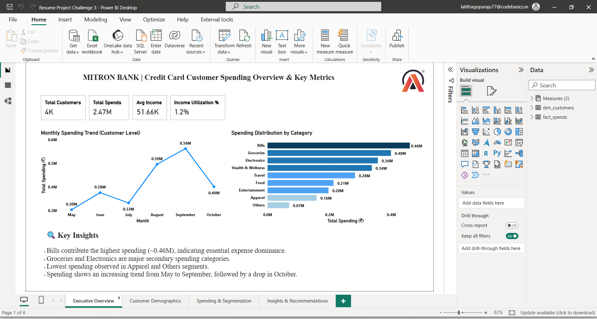
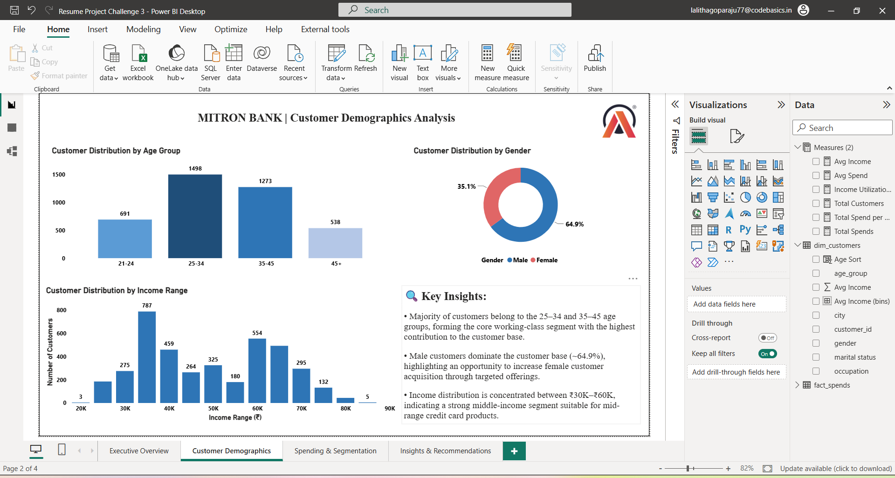
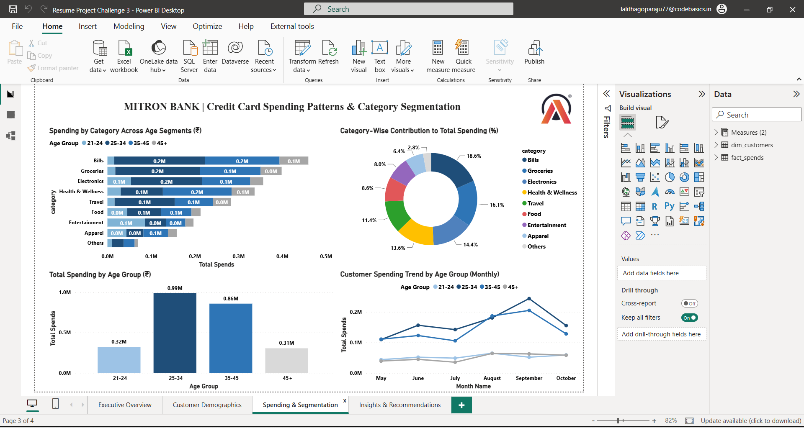

# 📊 Mitron Bank Credit Card Strategy Analysis

## 🧾 Project Overview

This project focuses on analyzing customer spending behavior for Mitron Bank, a legacy financial institution in India, to support the launch of a new credit card product.

The objective is to leverage data analytics and business intelligence to understand customer segments, spending patterns, and income utilization, enabling the bank to design data-driven credit card strategies.

---

## ❗ Problem Statement

Mitron Bank aims to introduce a new line of credit cards to expand its product offerings and market reach.

However, the strategy director, Mr. Bashnir Rover, is skeptical and has requested a pilot project using sample data before proceeding further.

The bank has provided a dataset of 4000 customers across five cities, including their demographics, income, and spending behavior.

The goal is to:

- Analyze customer data to identify key spending patterns  
- Segment customers based on behavior and demographics  
- Provide actionable recommendations for credit card features  
- Support strategic decision-making for product launch  

---

## 🎯 Objective

- Analyze customer demographics and spending behavior  
- Identify high-value customer segments  
- Evaluate income utilization patterns  
- Provide data-driven recommendations for credit card strategy  

---

## 📌 Key Metrics

The dashboard focuses on the following KPIs:

- **Total Spends**  
- **Average Monthly Spends**  
- **Average Income Utilization % (Spends / Income)**  
- **Spending by Category**  
- **Customer Segmentation (Age, Occupation, City)**  
- **Payment Method Distribution**  

📌 Income Utilization % is a critical metric as it indicates the likelihood of customers adopting and actively using credit cards 

---

## ⚠️ Data Disclaimer

Datasets used in this project are not included in this repository due to data privacy and usage guidelines.

However, the insights and analysis are based on the provided dataset structure.

---

## 🛠 Tools Used

- Power BI - Dashboard Development  
- Excel - Data Preparation
- SQL - Data Analysis concepts  

---

## 📸 Dashboard Preview

### Executive Overview

### Customer Demographics

### Spending & Segmentation

### Insights & Recommendations

---

## 🎥 Project Presentation (Audio Explanation)

👉 [Click here to listen to the project explanation](https://drive.google.com/file/d/1LUGwIvVVpA6z-6QwPG2OhyJRU1OhbfnH/view?usp=sharing)

---

## 💡 Key Insights

- Customers in the **25–34 age group** show higher spending and income utilization, making them ideal credit card targets  
- Salaried IT employees and business owners contribute the highest spending share  
- Entertainment, electronics, and lifestyle categories dominate spending patterns  
- Customers with higher income utilization % are more likely to adopt credit cards  
- UPI and debit cards dominate transactions, indicating an opportunity to shift users to credit cards  

---

## 🚀 Recommendations

- Target high-income and high-utilization customer segments with premium credit cards  
- Introduce category-based rewards (entertainment, electronics, travel)  
- Offer cashback incentives to shift users from UPI/debit to credit cards  
- Design entry-level cards for young professionals to increase adoption  
- Provide tailored offers based on customer occupation and spending behavior  

---

## 🙋‍♀️ Author

**G R S S SRI LALITHA**  
Aspiring Business Analyst | Power BI | SQL | Excel | Data Analysis | Data Visualization  
