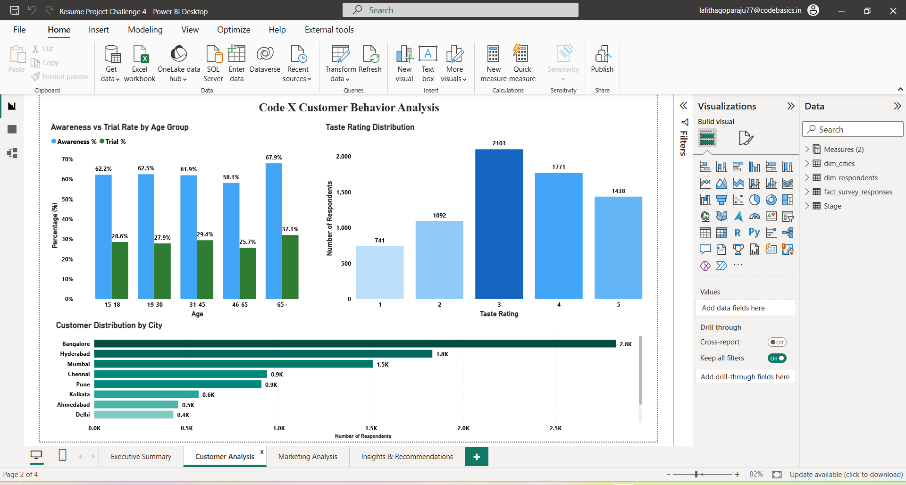
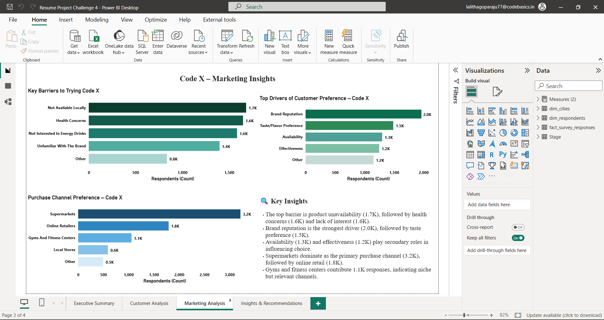
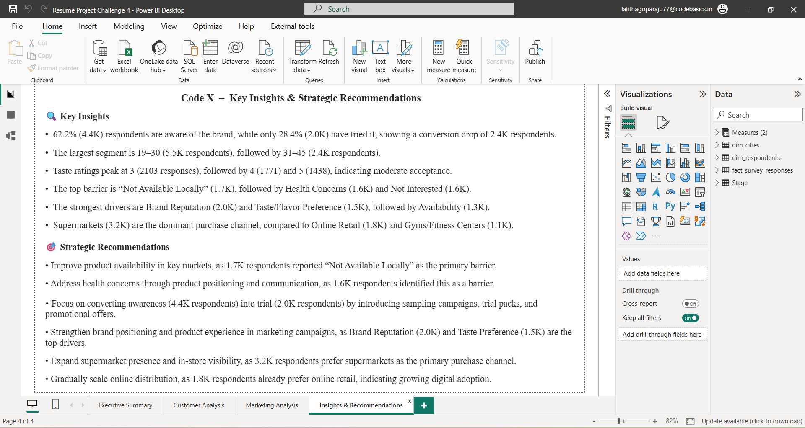

# 📊 CodeX Energy Drink Consumer Behavior Analysis

## 🧾 Project Overview

This project focuses on analyzing consumer behavior for CodeX, a German beverage company, to understand customer preferences, brand awareness, and market opportunities in the Indian energy drink market.

The objective is to convert survey data into meaningful insights that help the marketing team improve brand positioning, product development, and market penetration strategies.

---

## ❗ Problem Statement

CodeX launched its energy drink in 10 cities across India and aims to increase brand awareness, market share, and product adoption.

The marketing team conducted a survey with 10,000 respondents to understand consumer behavior, preferences, and perception of energy drinks.

Peter Pandey, a marketing data analyst, is tasked with analyzing this data and presenting actionable insights to the Chief Marketing Officer to support strategic decision-making. 

The goal is to:

- Analyze survey data to identify consumer preferences and behavior  
- Evaluate brand awareness and perception  
- Identify key target customer segments  
- Provide actionable recommendations for marketing and product strategy  

---

## 🎯 Objective

- Analyze demographic and behavioral patterns of consumers  
- Understand consumption habits and preferences  
- Identify key factors influencing purchase decisions  
- Provide data-driven recommendations to improve brand performance  

---

## 📌 Key Metrics

The dashboard focuses on the following KPIs:

- **Consumption Frequency**  
- **Brand Awareness %**  
- **Trial Rate (Tried Before %)**  
- **Taste Experience Rating**  
- **Purchase Behavior (Location & Price Range)**  
- **Marketing Channel Effectiveness**  

📌 Brand awareness and trial rate are critical metrics as they directly impact product adoption and market penetration.

---

## ⚠️ Data Disclaimer

Datasets used in this project are not included in this repository due to data privacy and usage guidelines.

However, the insights and analysis are based on the provided dataset structure and survey responses.

---

## 🛠 Tools Used

- Power BI - Dashboard Development  
- Excel - Data Preparation 
- SQL - Data Analysis concepts 

---

## 📸 Dashboard Preview

### Executive Summary

### Customer Analysis

### Marketing Analysis

### Insights & Recommendations

---

## 🎥 Project Presentation (Audio Explanation)

👉 [Click here to listen to the project explanation](https://drive.google.com/file/d/1IJbpzMAbFvnguo9AM5Ehjg-2fthwQckX/view?usp=sharing)

---

## 💡 Key Insights

- Majority of consumers belong to the **19–30 age group**, indicating strong youth demand  
- Brand awareness is moderate, but **trial rate is lower**, showing a gap between awareness and adoption  
- Consumers primarily consume energy drinks for **energy, focus, and fatigue reduction**  
- Taste, brand reputation, and availability are key factors influencing brand choice  
- Health concerns and lack of awareness prevent many users from trying the product  

---

## 🚀 Recommendations

- Increase brand awareness through targeted digital marketing campaigns  
- Focus on youth segment (19–30) with relatable and engaging promotions  
- Improve product positioning around **healthier ingredients and reduced sugar**  
- Enhance availability across cities to reduce accessibility barriers  
- Collaborate with influencers or brand ambassadors to boost trust and adoption  

---

## 🙋‍♀️ Author

**G R S S SRI LALITHA**  
Aspiring Business Analyst | Power BI | SQL | Excel | Data Analysis | Data Visualization  
