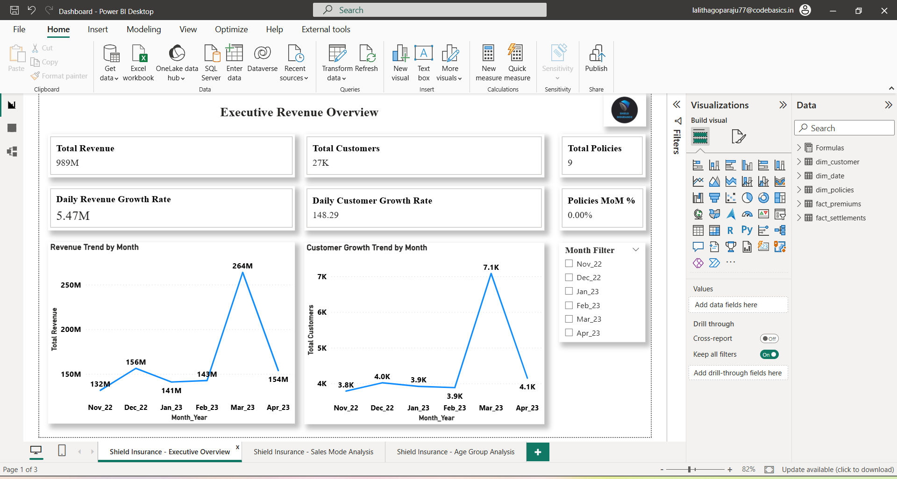
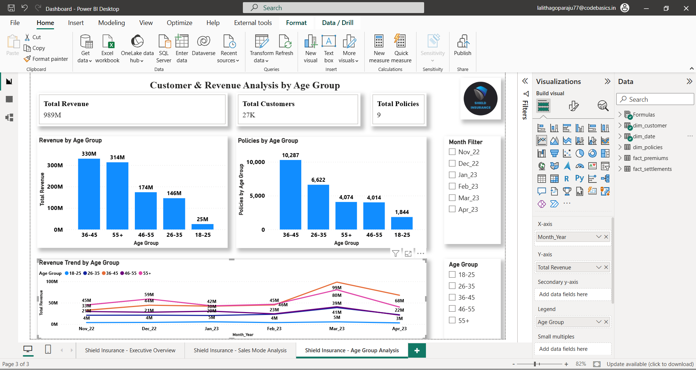

# 📊 Shield Insurance Dashboard Analysis

## 🧾 Project Overview  
This project focuses on designing and developing an **interactive business dashboard** for Shield Insurance to monitor key performance metrics and support strategic decision-making.

The dashboard is built by aligning with stakeholder (Mathew’s) requirements and follows a structured approach including **DAX metric planning, documentation, and visualization best practices**.

The goal is to ensure clarity, usability, and actionable insights for business users.

---

## ❗ Problem Statement  
Shield Insurance requires a dashboard to:

- Track business performance efficiently  
- Understand key KPIs across different dimensions  
- Enable quick decision-making through visual insights  

However, challenges include:

- Lack of structured KPI tracking  
- Difficulty in interpreting raw data  
- Limited visibility into performance trends  

---

## 🎯 Objective  

- Design a user-friendly and interactive dashboard  
- Create and document DAX metrics before implementation  
- Ensure clarity for stakeholders through proper documentation  
- Deliver insights that support business decision-making  

---

## 📌 Key Metrics  

The dashboard is built using well-defined DAX measures, including:

- Total Revenue  
- Total Customers  
- Policy Count  
- Claim Amount  
- Claim Settlement Rate  
- Growth Trends (Monthly / Yearly)  

📌 A structured **DAX Metrics List** was created before dashboard development to ensure accuracy and consistency.

---

## 🛠 Tools Used  

- **Power BI** – Dashboard Development  
- **Excel** – Data Preparation  
- **DAX** – Metrics & Calculations  

---

## 📸 Dashboard Preview  

### 🟢 Shield Insurance - Executive Overview 

---

### 🔵 Shield Insurance - Sales Mode Analysis 

---

### 🟣 Shield Insurance - Age Group Analysis 

---

## 🎥 Project Presentation (Audio Explanation)  

👉 **Listen to the Project Explanation:**  
(https://drive.google.com/file/d/1F4Er0NKAtjpAlT1_hhzULbOy1LTk1QD-/view?usp=sharing) 

---

## 💡 Key Insights  

- Key performance metrics are clearly visible in one place  
- Trends highlight business growth and performance gaps  
- Certain segments contribute more to revenue and claims  
- Interactive filtering enables deeper analysis  

---

## 🚀 Recommendations  

- Focus on high-value customer segments  
- Improve claim settlement efficiency  
- Use dashboard for regular performance monitoring  
- Enable data-driven decision-making  

---

## ⚠️ Data Disclaimer  

Datasets are not included due to data privacy and usage policies.

---

## 🙋‍♀️ Author  

**G R S S SRI LALITHA**  
Aspiring Business Analyst | Power BI | SQL | Excel | Data Analysis | Data Visualization  
